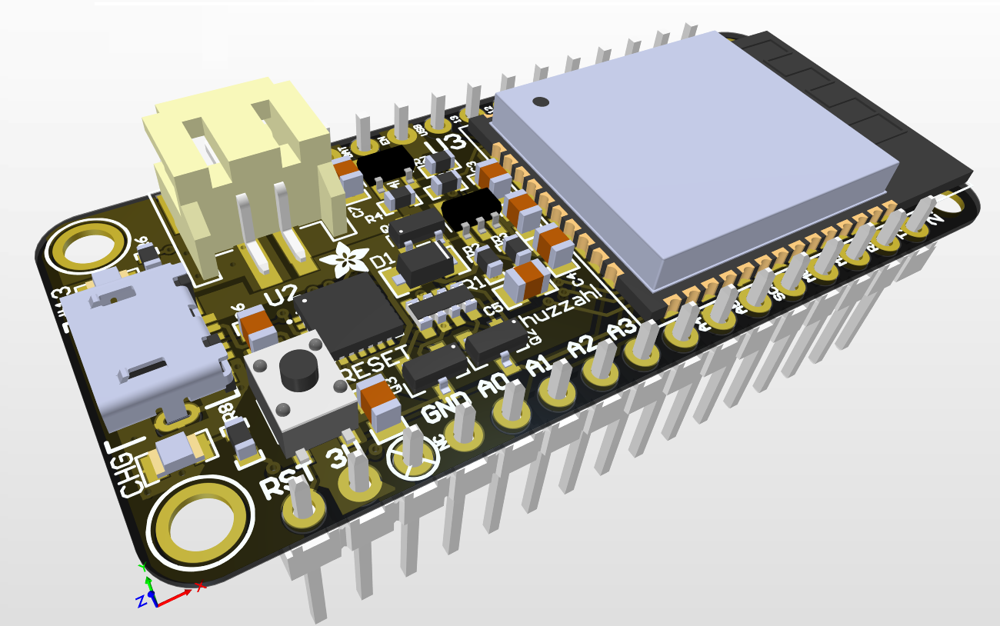
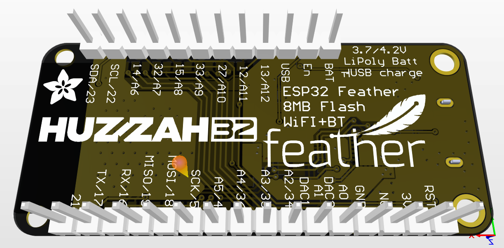

# HUZZAH32-remake

# Open Hardware Template
This is a skeleton for open hardware projects, based on KiCad designs for the schematics and PCB, and some software. 

**New:** There is now a bash script rename.sh that simplifies this task.

Please do NOT make your own designs forks of this template on Github.

## PCB Production
The design rules are set up for OSH Park, but double-check they fit your needs before using them. 

Please do not forget to add the text "Licensed under CERN OHL v.1.2" to the silkscreen of the PCB and to the schematics.

## Disclaimer
THE SOFTWARE IS PROVIDED "AS IS", WITHOUT WARRANTY OF ANY KIND, EXPRESS OR
IMPLIED, INCLUDING BUT NOT LIMITED TO THE WARRANTIES OF MERCHANTABILITY,
FITNESS FOR A PARTICULAR PURPOSE AND NONINFRINGEMENT. IN NO EVENT SHALL THE
AUTHORS OR COPYRIGHT HOLDERS BE LIABLE FOR ANY CLAIM, DAMAGES OR OTHER
LIABILITY, WHETHER IN AN ACTION OF CONTRACT, TORT OR OTHERWISE, ARISING FROM,
OUT OF OR IN CONNECTION WITH THE SOFTWARE OR THE USE OR OTHER DEALINGS IN THE
SOFTWARE.
